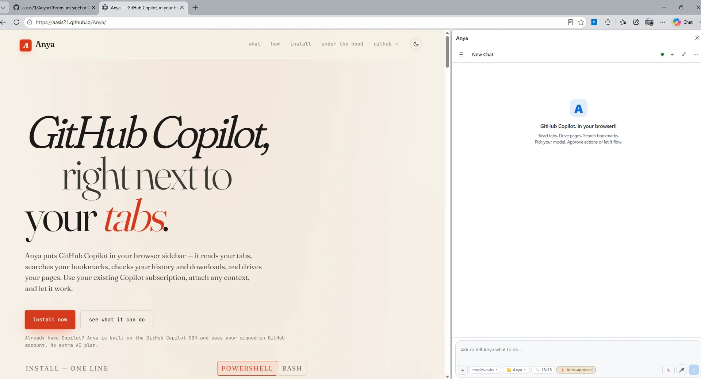
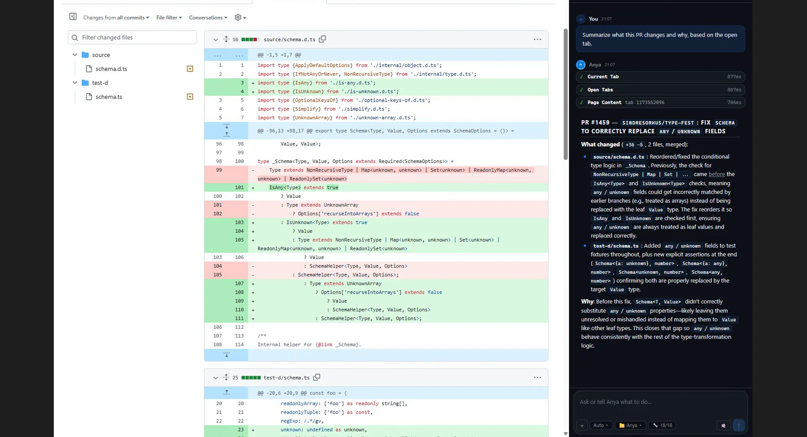
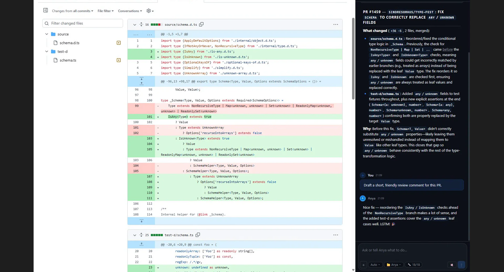
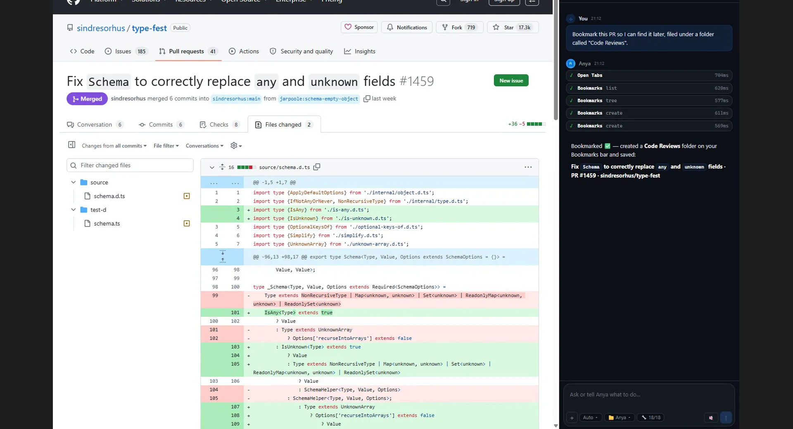

# Anya

> github copilot for your browser. powered by the copilot sdk.

**[Site](https://aasis21.github.io/Anya/) · [Install](#install) · MIT**

Anya is an MV3 sidebar extension for any Chromium-based browser — Edge, Chrome,
Chromium, Brave, Vivaldi, Arc — that talks to a local Node bridge wrapping
[`@github/copilot-sdk`]. On top of Copilot's standard tools (files, shell,
sub-agents, MCP), Anya adds browser-native powers: it reads your tabs, searches
bookmarks, checks history, drives pages via Playwright, and lets you right-click
anything on a page to attach it as context.

<p align="center">
  
</p>

<table>
<tr>
<td width="33%"><br/><sub><b>Summarize a PR.</b> Reads the diff tab, drafts the review.</sub></td>
<td width="33%"><br/><sub><b>Draft a review comment.</b> You approve before it posts.</sub></td>
<td width="33%"><br/><sub><b>Organize bookmarks.</b> "File this under Code Reviews" — done.</sub></td>
</tr>
</table>

```
┌────────────────────┐    JSON frames    ┌────────────────────┐
│  Browser sidebar   │ ◀─────────────▶   │  Node bridge       │
│  chat UI · 📎 menu │  Native Messaging │  @github/copilot-  │
│  context chips     │                   │  sdk + tools       │
└────────────────────┘                   └────────────────────┘
        ↑                                          │
        │ right-click · Alt+A · field tracking     │ shells out to
        │                                          ▼
   page-bridge.ts                           playwright-cli
   (content script)
```

---

## What you get

- **Browser tools, autonomous.** Anya reads tabs, searches bookmarks, checks
  history, lists open tabs, reads selections — on its own. Just ask.
- **"Add to Anya" context menu.** Right-click any element, field, link, or
  selection on a page. Anya captures it as a context chip with the element's
  text, tagged with `data-anya-ctx` for fresh re-reads.
- **📎 attach menu + @ references.** Click 📎 or type `@tab`, `@selection`,
  `@clipboard`, `@tabs`, `@bookmark:query` in the composer. All produce the
  same context chips — attachments are the content, @ tokens are just labels.
- **Field fill.** Focus a text field, ask Anya what to write. One click
  inserts the response — dispatches `input` + `change` events so React /
  Angular / Vue forms pick it up.
- **Voice in & out.** 🎤 to dictate — interim words stream live into the
  composer; 🔊 to hear replies, streamed sentence-by-sentence or read at end of
  turn. TTS is local; speech-to-text uses the browser's Web Speech API. First
  use grants mic access once via a small permission window.
- **Playwright automation.** `drive_tab`, `drive_browser`, `drive_context`,
  `drive_devtools` — Anya drives your real, logged-in browser. Same cookies,
  same session.
- **Local folders.** Attach a folder via 📎 → the SDK loads skills, prompts,
  and file tools from that repo.
- **Multi-chat with persistence.** Drawer with pin, tag, search, rename,
  delete, export to Markdown. Survives restarts via `chrome.storage.local`.
- **Streaming + tool cards.** Token-by-token streaming. Every tool call
  renders as an expandable card with args, progress, and result preview.
- **Approval for write tools.** Toggle "Require approval for write tools"
  in the 🔧 tools panel. When on, Anya asks before running any
  write/shell/MCP tool — you Allow or Deny each call. Read tools always
  auto-approve. Off by default.
- **Live debug panel.** 🐛 button traces every Native Messaging frame.
- **Hotkeys + slash commands.** `Ctrl+B/N/K/L/.`, `Ctrl+1..9`, plus
  `/help`, `/pin`, `/stop`, `/tag`, `/clear`, `/export`, `/open`.
- **Nothing leaves your machine.** No Anya server, no telemetry, no cloud
  sync. Chats in `chrome.storage`, bridge on localhost.

See [`design.md`](./design.md) for the full architecture.

---

## Repo layout

```
Anya/
├── README.md
├── design.md                     # architecture spec
├── setup.ps1                     # one-shot install/build/register (PowerShell 7+)
├── setup.sh                      # one-shot install/build/register (bash)
├── extension/                    # Chromium MV3 extension (Lit + Vite)
│   ├── manifest.json
│   ├── sidebar.html
│   ├── vite.config.ts
│   └── src/
│       ├── main.ts               # <anya-app> Lit component (UI, chat, tools, attachments)
│       ├── styles.ts             # extracted CSS
│       ├── types.ts              # ContextAttachment, ChatMessage, Chat, etc.
│       ├── native-bridge.ts      # chrome.runtime.connectNative wrapper
│       ├── background.ts         # side panel + "Add to Anya" context menu
│       ├── speech/               # Web Speech STT/TTS + mic-permission helper window
│       └── page-bridge.ts        # content script: element capture, field tracking, fill
└── bridge/                       # Node Native Messaging host
    ├── manifest.template.json
    ├── launcher.cmd / launcher.sh
    ├── install.ps1 / install.sh
    ├── uninstall.ps1 / uninstall.sh
    └── src/
        ├── host.ts               # NM stdio loop + frame router + folder-pick
        ├── copilot-bridge.ts     # SessionManager (one CopilotSession per chat)
        ├── sessions.ts           # CDP Playwright session manager
        ├── tools.ts              # SDK tool definitions
        ├── tool-rpc.ts           # bridge → extension RPC
        ├── native-messaging.ts   # length-prefixed JSON framing
        ├── config.ts             # ~/.anya/config.json loader
        ├── paths.ts              # cross-platform data-dir resolver
        └── log.ts                # bridge.log + debug-mirror sink
```

`AGENTS.md` at the repo root onboards any AI agent (Copilot CLI, Cursor,
etc.) working **on** the codebase. Anya's own system prompt is
`.github/agents/anya.agent.md` — a Copilot CLI
[custom-agent profile](https://docs.github.com/en/copilot/how-tos/copilot-cli/customize-copilot/create-custom-agents-for-cli)
loaded by `bridge/src/copilot-bridge.ts`.

---

## Install

### Requirements

- **Windows, macOS, or Linux**
- **Node 20+** (`node -v`)
- A shell to drive the installer:
  - **PowerShell 7+** (`pwsh`) on any OS — runs `setup.ps1`. Comes with
    Windows 11 / Server 2022; on macOS/Linux: `brew install powershell` /
    [microsoft.com/powershell].
  - **bash** — runs `setup.sh`. Native on macOS/Linux. On Windows use Git
    Bash, MSYS2, or Cygwin (any of these ship `cygpath` and `reg.exe` is
    on `PATH`). Inside WSL, `setup.sh` will install for browsers running
    **inside WSL** — to register Windows-host browsers from WSL, invoke
    `setup.ps1` via `pwsh.exe`/`cmd.exe` interop instead.
- **A Chromium-based browser** with developer-mode extensions enabled. Anya
  is installed and tested in: **Microsoft Edge, Google Chrome, Chromium,
  Brave, Vivaldi, Arc** (Arc is Windows + macOS only — no Linux build).
- A [**GitHub Copilot subscription**](https://github.com/features/copilot) (Individual, Business, or Enterprise) with the Copilot CLI logged in (`copilot auth status`)
- **`@playwright/cli`** for browser automation: `npm i -g @playwright/cli`
- **Remote debugging enabled** in your browser — open
  `edge://inspect/#remote-debugging` (or `chrome://inspect/...` etc.) and
  check "Allow remote debugging for this browser instance". This is needed
  for Anya to drive tabs via CDP.

### One-line install (recommended)

**PowerShell 7+** on Windows, macOS, or Linux:

```pwsh
irm https://raw.githubusercontent.com/aasis21/Anya/main/install.ps1 | iex
```

**bash** on macOS or Linux:

```bash
curl -fsSL https://raw.githubusercontent.com/aasis21/Anya/main/install.sh | bash
```

Either clones the repo to `~/Anya` and runs `setup.ps1` / `setup.sh` for you. To customise:

```pwsh
# PowerShell — pass through args
& ([scriptblock]::Create((irm https://raw.githubusercontent.com/aasis21/Anya/main/install.ps1))) `
    -InstallDir D:\code\Anya -Branch main -Browsers edge,chrome
```

```bash
# bash — pass through args after `--`
curl -fsSL https://raw.githubusercontent.com/aasis21/Anya/main/install.sh | bash -s -- \
    --install-dir ~/code/Anya --branch main --browsers chrome,brave
```

### Developing locally

If you want to **hack on Anya** (modify the bridge, the extension, the
agent prompt, etc.), clone it manually and run `setup.ps1` directly so
your edits aren't blown away by the bootstrap re-clone:

```pwsh
# PowerShell 7+ — Windows, macOS, or Linux
git clone https://github.com/aasis21/Anya.git
cd Anya
.\setup.ps1
```

```sh
# bash — Windows (Git Bash / MSYS2 / Cygwin), macOS, or Linux
git clone https://github.com/aasis21/Anya.git
cd Anya
./setup.sh
```

This runs `npm install` + `npm run build` for both projects, the bridge ping
smoke test, then registers the Native Messaging host **for every Chromium
browser detected on the machine** and prints the per-browser load
instructions. If multiple browsers are present you'll get an interactive
picker.

| Switch (`setup.ps1`)| Flag (`setup.sh`)        | Effect                                                              |
| ------------------- | ------------------------ | ------------------------------------------------------------------- |
| `-Browsers edge`    | `--browsers edge`        | Register only for the named browser(s). Valid: `edge`, `chrome`, `chromium`, `brave`, `vivaldi`, `arc`, `all`. |
| `-Quiet`            | `--quiet`                | Skip the interactive picker; install for everything detected.       |
| `-SkipTest`         | `--skip-test`            | Skip the bridge ping/pong smoke test.                               |
| `-Uninstall`        | `--uninstall`            | Remove the NM host entries from every Chromium browser. |

### How registration works on each OS

| OS      | Mechanism      | Where                                                                                  |
| ------- | -------------- | -------------------------------------------------------------------------------------- |
| Windows | HKCU registry  | `HKCU:\Software\<vendor>\<browser>\NativeMessagingHosts\com.anya.bridge` → manifest    |
| macOS   | File drop      | `~/Library/Application Support/<vendor>/<browser>/NativeMessagingHosts/com.anya.bridge.json` |
| Linux   | File drop      | `~/.config/<vendor>/<browser>/NativeMessagingHosts/com.anya.bridge.json`               |

Bridge runtime data lives at:

| OS      | Path                                             |
| ------- | ------------------------------------------------ |
| Windows | `%LOCALAPPDATA%\Anya\`                           |
| macOS   | `~/Library/Application Support/Anya/`            |
| Linux   | `${XDG_DATA_HOME:-~/.local/share}/Anya/`         |

### Load the extension in each browser

Once the bridge is registered you need to load the unpacked extension in each
browser you plan to use Anya in. The manifest pins a deterministic extension
ID (`oopdnihjfloclgnbbkebgeiipfadebid`) via its `key` field, so the same ID
is granted Native Messaging access in every browser.

| Browser   | Extensions URL          |
| --------- | ----------------------- |
| Edge      | `edge://extensions`     |
| Chrome    | `chrome://extensions`   |
| Brave     | `brave://extensions`    |
| Vivaldi   | `vivaldi://extensions`  |
| Chromium  | `chrome://extensions`   |
| Arc       | `arc://extensions`      |

In each:

1. Toggle **Developer mode**.
2. **Load unpacked** → pick `extension/dist/`.
3. Confirm the extension ID matches `oopdnihjfloclgnbbkebgeiipfadebid`.
4. Pin the action icon → click it → sidebar opens.

### Smoke test

- Type `ping` → should answer `PONG`. This validates the bridge handshake
  without involving the Copilot SDK.
- Type a real prompt → streamed response with inline tool cards.

### Updating

Run the same one-liner you used to install:

```pwsh
irm https://raw.githubusercontent.com/aasis21/Anya/main/install.ps1 | iex
```

```bash
curl -fsSL https://raw.githubusercontent.com/aasis21/Anya/main/install.sh | bash
```

If the repo already exists at `~/Anya`, the installer pulls the latest
changes (`git pull --ff-only`) and re-runs `setup.ps1` to rebuild
everything. Same command to install and update.

If you cloned manually for development:

```pwsh
cd Anya
git pull
.\setup.ps1
```

After updating, reload the extension in your browser
(`edge://extensions` → Reload).

### Uninstalling

```pwsh
# Remove bridge registration from all browsers
cd ~/Anya
.\setup.ps1 -Uninstall
```

```bash
cd ~/Anya
./setup.sh --uninstall
```

This removes the Native Messaging registry entries / manifest files.
Then manually remove the unpacked extension from your browser and
delete the `~/Anya` folder if you no longer need it.


---

## Using the sidebar

### Header

| Icon  | Action                                                       |
| ----- | ------------------------------------------------------------ |
| ☰     | Toggle the chat drawer (`Ctrl+B`)                            |
| ＋    | New chat (`Ctrl+N`)                                          |
| 🐛    | Toggle the bridge debug panel                                |
| ⋯     | Menu: Remote Debug, Debug Log, Dark Theme                    |

### Tools panel

Open via the **🔧** pill in the composer bar.

- Toggle individual tools on/off across 4 groups: Browser Context,
  Browser Actions, Playwright Connection, Playwright Driving.
- **"Require approval for write tools"** toggle — when ON, Anya pauses
  before executing any write/shell/MCP tool and shows an approval banner
  above the composer with **Allow** / **Deny** buttons. Read-only tools
  (tab content, history, selections, bookmarks search) always auto-approve.
  Off by default.
- **"all on" / "all off"** buttons for quick bulk toggling.

### Chat drawer

- **`⌕`** — search chats (`Ctrl+K`)
- **`＋`** — new chat (`Ctrl+N`)
- **`★ / ☆`** — pin / unpin (pinned chats float to the top)
- **`✎`** — rename
- **`⬇`** — export to Markdown
- **`×`** — delete (asks for confirmation)
- **Tag chips** — click to filter; click _all_ to clear
- **Per-row stats** — `N msg · ~T tok · age` (relative time)

### Context attachments

Anya uses a **unified context attachment system**. Content arrives as
**attachments** (context chips above the composer). The user's message
text contains **@-reference tokens** that point back to those attachments.

**Attachments are the content. @ tokens are labels.**

Three ways to attach:

| Method | What happens |
| --- | --- |
| **Right-click → "Add to Anya"** | Captures the element, field, link, selection, or page you clicked. Smart walk-up finds meaningful containers. |
| **📎 menu** | Click 📎 in the composer → attach current tab, all tabs, clipboard, bookmarks, history, local folder. |
| **`@` autocomplete** | Type `@` → pick from the list. Same attachments, keyboard-first. |

All three call `attach(kind)` → `commitAttachment(chip)` → inject `@refLabel` at cursor.

#### Attachment kinds

| @ token | Kind | What's captured |
| --- | --- | --- |
| `@tab` | 🌐 tab | Full active tab content (≤5K inline, ref for full) |
| `@selection` | ✂️ selection | Highlighted text on the page |
| `@clipboard` | 📋 clipboard | System clipboard text |
| `@tabs` | 📑 tabs | Markdown table of every open tab |
| `@url` | 🔗 url | Active tab URL |
| `@title` | 📌 title | Active tab title |
| `@tab:query` | 🌐 tab | One tab by id or title/url search |
| `@bookmark:query` | 🔖 bookmark | Bookmark search results |
| `@element:Name` | 📄 element | Right-clicked DOM element |
| `@field:Name` | ✏️ field | Right-clicked text field (for AI fill) |
| `@link:Name` | 🔗 link | Right-clicked link (URL + text) |
| `@image:name` | 🖼️ image | Pasted/dropped image |
| `@folder:name` | 📁 folder | Local project folder |

#### How it reaches the model

```
[Context — attached by the user]
[1] 🌐 PR #4521 — ref: @tab (25,412 chars)
... first 5,000 chars ...
→ call get_tab_content({ tabId: 42 }) for full text

[2] 📄 Change summary — ref: @element:Change-summary (847 chars)
Change summary: Why? PR1 of a 3-PR Redis migration...

[Message]
summarize @tab and compare with @element:Change-summary
```

@ tokens stay as-is in the text. The real content is in the numbered
attachments. The model reads from there.

#### `/` — slash commands

Client-side only. Never sent to the model.

| Command                  | Action                                                  |
| ------------------------ | ------------------------------------------------------- |
| `/new`                   | Start a fresh chat (`Ctrl+N`)                           |
| `/clear`                 | Wipe the current chat (`Ctrl+L`)                        |
| `/rename [title]`        | Rename current chat (no arg → inline edit)              |
| `/delete`                | Delete current chat                                     |
| `/pin`                   | Toggle pin for the current chat                         |
| `/tag add\|rm <name>`    | Add or remove a tag                                     |
| `/tag list`              | List tags on the current chat                           |
| `/search [query]`        | Open chat search, optionally pre-filled (`Ctrl+K`)      |
| `/export`                | Download the current chat as Markdown                   |
| `/stop`                  | Cancel the in-flight stream (`Ctrl+.`)                  |
| `/open <folder>`         | Open a new chat rooted in a local folder                |
| `/help`                  | Print this list inside the chat                         |

### Hotkeys

| Key            | Action                                          |
| -------------- | ----------------------------------------------- |
| `Ctrl+B`       | Toggle chat drawer                              |
| `Ctrl+N`       | New chat                                        |
| `Ctrl+K`       | Search chats                                    |
| `Ctrl+L`       | Clear current chat                              |
| `Ctrl+.`       | Cancel in-flight stream                         |
| `Ctrl+1..9`    | Switch to the Nth chat in drawer order          |
| `Ctrl+/`       | Cycle through quick-prompt templates            |
| `Esc`          | Close drawer / search / debug                   |

### Per-message actions

Hover any message and click `⋯` to copy, delete, or (on user messages) re-send
the same prompt as a fresh turn.

### Stop generating

While a response is streaming, the **send** button becomes a red **stop**
button. Pressing it (or `Ctrl+.`) flips a soft-cancel flag that ignores any
remaining deltas. Note: the bridge keeps streaming on its end — the SDK does
not yet expose `abort()` — so we just stop painting.

---

## Browser automation (Playwright)

Anya can drive your real, logged-in browser — any Chromium-based browser with
remote debugging enabled. The flow:

1. Enable remote debugging: open `edge://inspect/#remote-debugging` (or
   `chrome://inspect/...` for Chrome) and check the box.
2. The agent calls `connect_browser` to attach via CDP.
3. Now the agent's `drive_*` tools can drive any tab — open, switch, close,
   click, type, screenshot, etc.
4. `disconnect_browser` releases control; the browser stays open.

---

## Debug panel

Click 🐛 in the header for a live trace of every Native Messaging frame and
every `log()` line from the bridge. Click any row to expand its JSON. The
bridge log file path is shown at the top — click to copy. From DevTools:
`anya.debug()`.

For terminal tailing:

```pwsh
.\scripts\tail-bridge-log.ps1
```

---

## Development

```pwsh
cd extension && npm run dev      # Vite watches src/
cd bridge    && npm run build    # tsc; rerun after .ts changes
```

Logs go to the bridge log file (also live in the 🐛 panel):

| OS      | Log file                                                     |
| ------- | ------------------------------------------------------------ |
| Windows | `%LOCALAPPDATA%\Anya\bridge.log`                             |
| macOS   | `~/Library/Application Support/Anya/bridge.log`              |
| Linux   | `${XDG_DATA_HOME:-~/.local/share}/Anya/bridge.log`           |

**Sidebar shows "disconnected" and `bridge.log` is missing/empty (macOS
especially)**: Chrome/Edge/Brave launch Native Messaging hosts with a
minimal environment that does **not** include your login shell's `PATH`.
If Node was installed via nvm/volta/asdf/homebrew rather than Apple's or
Node's official installer, the launcher's bare `node` call can fail to
resolve — the host process exits before it ever writes a log line.
`bridge/launcher.sh` handles this by caching the exact `node` path
`install.sh`/`install.ps1` used (in `bridge/.node-path`) and falling back to
common install locations; re-run `./setup.sh` (or `install.ps1`) after a
Node version change so the cache stays fresh.

The extension keypair lives at `.extension-key.pem` (gitignored). Its public
key is baked into `extension/manifest.json` so the extension ID stays stable
across reloads — that matters because the bridge's Native Messaging manifest
whitelists exactly that ID.

**UI testing without touching your daily browser:** see "UI testing
(Playwright, isolated from your live browser)" in [`AGENTS.md`](AGENTS.md)
for driving the real built sidebar (live bridge, real tool calls, real
streamed replies) from a throwaway Chromium instance.

### File-by-file

**Extension (`extension/src/`):**

- `main.ts` — `<anya-app>` Lit component. UI state, chat store, frame
  handler, tool RPC, context attachment system (`attach` → `commitAttachment`),
  📎 menu, and the render tree.
- `styles.ts` — extracted CSS (one big `css` tagged template).
- `types.ts` — `ContextAttachment`, `ChatMessage`, `Chat`, `AttachmentKind`,
  `ATTACHMENT_VALUE_CAP`, etc.
- `native-bridge.ts` — wraps `chrome.runtime.connectNative` with auto-reconnect.
- `background.ts` — side panel behavior + "Add to Anya" context menu registration.
- `page-bridge.ts` — content script on every page: captures right-clicked
  elements (smart DOM walk-up), tracks focused text fields, handles fill
  commands, `safeSend` wrapper for extension context invalidation.

**Bridge (`bridge/src/`):**

- `host.ts` — Native Messaging stdio loop. Routes frames to the
  `SessionManager`, tool/RPC handlers, and folder-pick dialog.
- `copilot-bridge.ts` — `SessionManager`. One `CopilotClient` shared, one
  `CopilotSession` per chat id, lazy-created and cached.
- `sessions.ts` — CDP Playwright session manager. Connects via
  `playwright-cli attach --cdp`, provides `runPlaywrightCmd` for tool handlers.
- `tools.ts` — defines browser tools (`get_active_tab`, `list_tabs`,
  `get_selection`, `get_tab_content`, `browse_history`, `find_bookmarks`,
  `edit_bookmarks`, `get_attached`) and the Playwright `drive_*` family.
- `tool-rpc.ts` — request/response correlation for bridge → extension tool
  calls (where the bridge needs `chrome.*` data).
- `config.ts` — loads `~/.anya/config.json`.
- `log.ts` — appends to `bridge.log` and mirrors to the debug panel.

---

## Uninstall

```pwsh
.\setup.ps1 -Uninstall
```

```sh
./setup.sh --uninstall
```

Then remove the unpacked extension from your browser's extensions page.

[`@github/copilot-sdk`]: https://www.npmjs.com/package/@github/copilot-sdk
